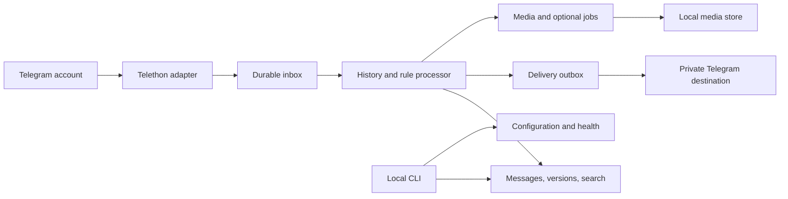

# Personal Telegram daemon: proposed design

Status: long-term design, 2026-09-26. A runnable daemon and private notification bot now exist. The [README](README.md) is the current behavior and setup contract. Commands, settings, and performance targets below also include future work; they are not all implemented.

The baseline follows the updated request: personal-only monitoring by default, switchable scope, and bot-delivered edit/deletion reports. Normalized history and notification intents commit together, without a separate inbox table. Bounded media capture is enabled by default. Bot API sends have no client idempotency key: uncertain deliveries require explicit retries instead of the MTProto send strategy proposed below. Watch rules, digests, debouncing, quiet hours, and automatic backfill remain future work.

**Product purpose.** Remember what changed in the Telegram conversations you choose, make that history searchable, and interrupt you only when something deserves attention. Deletion recovery is the first use case. The reusable core is a retained history of observed messages and changes.

Assume one owner and one Telegram account per running instance, with selected channels, groups, and personal conversations. Start with an explicit empty selection. Joining a chat does not automatically enroll it. Resolve selections to stable typed peer IDs; display names and usernames are labels that can change. The owner can choose different retention and notification policies for each source.

The service observes selected chats and sends output only to destinations the owner configures. Reading history should not mark conversations as read. Joining chats, changing folders, sending replies to other people, and modifying source messages are separate actions outside the first release. Secret chats and ephemeral-media recovery are outside the initial scope.

**Features worth building.** Prioritize features that benefit from the same captured history.

| Feature | Personal value | Priority |
| --- | --- | --- |
| Deletion recovery | See the retained version of a message that disappeared, with its source and observation time. | First release |
| Edit history | Notice a changed price, address, deadline, or claim; inspect earlier observed versions. | First release |
| Search and export | Find retained text across chats, deleted posts, and old versions; export selected results to Markdown or JSON. | First release |
| Keyword and source watches | Surface an apartment listing, project mention, or announcement from otherwise muted chats. | Next |
| Quiet digest | Review changes and watch matches once a day, grouped by source and linked to retained records. | Next |
| Saved collections | Explicitly keep a message, thread excerpt, link, or attachment beyond the normal retention window. | Next |
| Selective media capture | Preserve documents, photos, and voice messages from sources where that matters. | After text recovery is dependable |
| Follow-up reminders | Remind the owner about a manually flagged conversation; later offer suggestions for unreplied direct chats. | Later |
| OCR, transcription, semantic search | Retrieve information inside captured attachments and search by meaning. | Optional later processors |
| Summaries and duplicate grouping | Reduce repeated forwarded posts and summarize selected source activity with citations. | Optional later processors |

Edit history is the closest companion to deletion recovery and should ship alongside it. Keyword watches are the strongest expansion into everyday utility. A digest can initially be deterministic excerpts and counts. Model-based features are optional, explicitly configured, and never required for capture, recovery, or ordinary search. Any external inference service receives only the content from sources selected for that service. Models cannot execute instructions from messages or send replies.

**The owner's experience.** Setup authenticates the account once, shows accessible chats, and lets the owner select sources and a notification destination. The daemon then runs under a service manager. CLI commands provide local administration; notifications appear in Telegram. A searchable web interface can be added after the underlying behavior is stable.

Proposed command surface:

```text
tgdaemon init
tgdaemon auth
tgdaemon sources list
tgdaemon sources add <peer>
tgdaemon run
tgdaemon status
tgdaemon search "deadline" --changed
tgdaemon history <record-id>
tgdaemon export --source <peer> --format markdown
tgdaemon backup <destination>
tgdaemon restore <backup>
```

`status` reports connection state, capture activity, pending work, known coverage gaps, storage consumption, and blocked deliveries. A quiet source is not itself an error. Search returns one result per message by default, identifies which version matched, and allows the owner to expand its observed history. Search and export work offline on retained data.

A deletion notification might read:

```text
Deletion observed · Apartment group
Author: Alex · Sent 14:02 · Deletion observed 14:19

“Viewing is tomorrow at 18:00. Rent is €1,200.”

Last captured version · 1 earlier version available
Record: m_7b31
```

This identifies the message author, not the person who deleted it. Telegram's ordinary deletion updates do not identify that actor or provide an exact deletion timestamp. After reconnection, display “observed after an offline period” instead of pretending to know when the deletion happened. Use source links when available and a stable local record ID even when the original link no longer works. [Deletion update fields](https://core.telegram.org/constructor/updateDeleteMessages), [channel deletion fields](https://core.telegram.org/constructor/updateDeleteChannelMessages).

Capture every observed text/caption/media change; suppress noisy notifications independently. Consecutive edits can produce one alert after a short debounce, while all observed versions remain available. Ignore changes limited to view counts, reactions, or link-preview refreshes when identifying substantive edits. Batch mass deletions by source. Respect quiet hours, escape message content when rendering, and split long output at Telegram-safe boundaries without breaking formatting entities. Albums keep a group identifier and report partial capture explicitly.

Saved Messages is a convenient default output, although a separate private channel may give the owner a better notification experience. Exclude all output destinations from monitoring in the first release to prevent feedback loops. If indexing user-saved messages is added later, distinguish owner-created saves from daemon output explicitly. A separate bot is an optional future control interface, not a collection dependency.

**Architecture.** Use Python with asyncio and a pinned stable Telethon release behind a small adapter. Use SQLite on local disk, FTS5 for text search, and a bounded local directory for captured media. Run a single process with supervised tasks and one serialized database writer. This is sufficient for an individual account and keeps installation, backup, and debugging manageable. [SQLite FTS5](https://www.sqlite.org/fts5.html).



The inbox, retained history, job tables, and outbox live in the same application database. Telethon's session is separate. Module boundaries are `telegram`, `ingest`, `history`, `rules`, `delivery`, `media`, `storage`, and `cli`; they are ordinary internal modules, not a plugin framework.

1. The adapter receives an update, applies source scope where resolvable, and persists a versioned event envelope before downstream work. Unknown private-chat deletions are resolved through the stored message index. Excluded content must not enter the application journal.
2. A processor reads a pending inbox record and, in one transaction, updates retained history, evaluates rules, enqueues delivery/media jobs, and marks the record processed.
3. Delivery and media workers claim durable jobs, perform network work outside database transactions, and persist results. Network failure cannot roll back captured history.
4. Maintenance expires content, enforces quotas, and creates backups independently of message arrival. No cleanup routine depends on receiving a particular number of messages.

Use short database transactions, foreign keys, WAL mode, a busy timeout, and durable commit settings. Keep database I/O off the network event loop while waiting for each intake write to finish. Bound queues and pause/disconnect intake with a visible gap if persistence fails; never silently drop overflow. Diagnose the linked SQLite runtime, including FTS5 availability and a version containing the WAL-reset fix, when packaging the release. [SQLite WAL behavior and runtime fixes](https://www.sqlite.org/wal.html).

**Data model and invariants.** Persist normalized, schema-versioned records, not executable Python serialization or library objects that require an old Telethon version to load.

| Entity | Required information |
| --- | --- |
| Account and peer | Account ID, typed peer ID, current label, observed label history, source policy |
| Inbox event | Local ID, account, Telegram message namespace, update kind, available update sequence fields, observation time, schema version, processing state |
| Message | Stable local ID, account/namespace/message ID, source peer, author snapshot, sent time, first/last observation, lifecycle state, reply/topic/album references |
| Version | Message ID, observed order, server edit time if present, text, entities, attachment metadata, content fingerprint, provenance |
| Change | Kind, affected message/version IDs, observation time, source update identity, completeness markers |
| Outbox/job | Unique intent key, destination, payload/version references, stable send identifiers, attempt state, retry time, result or diagnostic |
| Coverage | Source or account scope, monitoring start, offline/failed intervals, catch-up attempts, unresolved gaps |
| Media asset | Hash, relative path, size/type, capture state, version references, expiry |

Canonical message identity is `(account_id, namespace, message_id)`. Private chats and basic groups share an account message namespace; channels and supergroups have a namespace per channel. Store the typed source peer separately. A deletion without a chat ID must only search that account's common namespace, never unrelated channel rows with the same numeric ID. Account and peer type are part of every relevant identity. [Telegram message identifiers](https://docs.telethon.dev/en/v2/concepts/messages.html#message-identifiers).

Retain observed versions without overwriting them, subject to retention. Deduplicate replayed updates using the source update identity/sequence where available and a canonical payload fingerprint as a fallback. A content fingerprint is not a permanent unique version key: an A → B → A edit sequence must retain all three observed versions. Stale replay or backfill must not replace a newer live version or resurrect a deleted message. Uncertain ordering is represented explicitly. An edit first seen without its original becomes “earlier version unavailable.” An unmatched deletion becomes a bounded diagnostic/tombstone, not invented content or a noisy alert.

A processed change can create at most one local notification intent per rule and destination. Persist a ruleset version with that decision. Rule edits affect future events unless the owner requests a previewed replay. Replaying history defaults to rebuilding state without sending notifications. Database migrations are versioned and atomic; incompatible older binaries refuse to open a newer schema.

**Recovery contract.** The local durability guarantee begins when an event is committed to the inbox. From that point, a process restart must preserve the event and complete its effects without duplicating local history or notification intent. This does not imply complete capture of every Telegram event or exactly-once delivery over the network.

Telethon documents that Telegram does not always emit a deletion notification. Register handlers before requesting catch-up. On restart, recover local work, reconnect, and request supported missed updates. A first-time, owner-requested history import captures the versions still available, labels them as imported, and suppresses old-event notifications. It cannot recover already deleted content or all earlier edits. [Telethon deletion events](https://docs.telethon.dev/en/stable/modules/events.html#telethon.events.messagedeleted.MessageDeleted), [catch-up](https://docs.telethon.dev/en/stable/modules/client.html#telethon.client.updates.UpdateMethods.catch_up).

The client session's update cursor and the application inbox are not automatically one transaction. A crash can therefore leave a window between library processing and durable application capture. Test that boundary explicitly, record unclean shutdowns as potentially incomplete intervals, and reconcile a bounded recent history where possible. Do not claim that a successful catch-up proves completeness. Telegram's recoverable update history is finite. Missing history rows during reconciliation mean “unavailable,” not proof of a deletion. [Telegram update recovery](https://core.telegram.org/api/updates).

For output, persist the delivery identity before sending and reuse MTProto `random_id` values for retries where supported. Track multipart sends separately. A crash after Telegram accepted a send but before local confirmation is an ambiguous delivery, not a known failure: try reconciliation and surface unresolved ambiguity. Local intent uniqueness does not establish unlimited server deduplication. Record returned destination/message IDs on confirmed success. Back off transient errors, honor `FloodWait` deadlines without blocking ingestion, and expose permanent destination/auth failures. [Send identity](https://core.telegram.org/api/updates), [Telethon RPC errors](https://docs.telethon.dev/en/stable/concepts/errors.html).

**Storage and media policy.** Suggested initial settings, all owner-adjustable:

| Setting | Proposed default |
| --- | --- |
| Source selection | Empty explicit allowlist |
| Ordinary message/version cache | 7 days from receipt for live messages; imports get an explicit expiry |
| Changed-message history | 90 days after an observed edit/deletion, including the retained versions needed to explain it |
| Notification behavior | Deletions promptly; edits debounced; per-source quiet/digest options |
| Attachment handling | Metadata only; clearly marked as not locally captured |
| Optional capture limits | 20 MiB per file; 2 GiB total media budget; per-source opt-in |
| Saved collections | Retain until the owner removes them, within an explicit storage budget |
| Model-based processing | Disabled |

The retention difference is deliberate: a short working cache makes future deletions recoverable, while changes remain useful longer. Search only covers what is still retained. Users seeking a general personal archive can extend ordinary history retention per source. Changing expiry or storage limits must show the affected records in a preview. A hard disk reserve overrides growth; the daemon becomes visibly degraded instead of deleting explicitly kept items without a policy.

Telegram media references can expire and require refreshing from an accessible source. Therefore metadata-only mode provides best-effort re-fetching, not a media backup. Reliable retained bytes require a successful download while access still exists. Optional capture starts on arrival, uses bounded concurrency, writes to a temporary file, verifies and renames atomically, and references assets by content hash. A deletion racing a download can still win; retain that outcome. [Telegram file references](https://core.telegram.org/api/file-references).

Use explicit states such as `metadata_only`, `queued`, `captured`, `skipped_size`, `unavailable`, and `expired`. Apply retention consistently to inbox payloads, message versions, search indexes, derived content, outbox payloads, and unreferenced media. Pending delivery may hold content only within its configured expiry; expired jobs are marked accordingly. Keep content-free deduplication tombstones for a bounded replay window. Backups have their own expiry. Local purge does not erase copies already delivered into Telegram or owner-created exports.

**Public repository, private installation.** Keep configuration, sessions, databases, attachments, logs, and backups in OS-specific application data directories outside the checkout. Store secrets in an OS keychain or a restricted secret file; use environment injection for containers. Restrict directory/file permissions and redact logs by default. Session files contain account credentials and cached peer data, so they receive the same protection as message storage. [Telethon session contents](https://docs.telethon.dev/en/stable/concepts/sessions.html).

Ordinary SQLite is not encryption at rest. The baseline uses an encrypted host volume; portable encrypted storage is a separate, explicit capability that must also cover attachments and backups. Telethon may cache some entities beyond the configured application sources; document that boundary rather than claiming the session contains only selected chats.

The public repository should include synthetic fixtures, a configuration example with invented identifiers, session/database ignore rules, secret scanning, reproducible dependency locks, migration notes, and an explicit project license before release. No real chat exports in bug reports or tests. Treat this as a new implementation; review provenance and licensing before copying upstream code. Third-party contributions should exercise the offline test suite without account credentials. Live smoke checks are a separate owner-run command against a dedicated test chat.

**Operating it.** Prefer a persistent machine for continuous capture; a sleeping laptop creates honest coverage gaps. Support foreground execution first, then a Linux systemd unit and container, with a macOS launchd example for local use. Run as an unprivileged user, enforce a single-instance lock per data directory, and persist both the application database and the Telegram session across container restarts. No public network listener is required.

On termination, stop intake, finish admitted writes, persist worker state, and close cleanly with a deadline. On startup, validate config and destination exclusions, apply migrations with a pre-migration backup, resume pending jobs, and reconnect. Coordinate capture, downloads, catch-up, and notification RPCs through bounded scheduling so account rate limits cannot produce an unbounded backlog. Never auto-enable paid rate-limit bypasses.

Health includes connection/auth state, last successful intake and processing times, queue age, disk reserve, failed jobs, and coverage gaps. Report state changes rather than posting a heartbeat message every minute. Local health must remain useful when Telegram is unavailable. Remote outage notification requires an independently configured monitoring channel.

Use SQLite's backup API for a consistent database snapshot. Include schema/config versions and a manifest of referenced captured media; pin those assets during backup. Treat credential/session backup as a separate explicit option. Restore while the daemon is stopped, verify the manifest and database integrity, and default to delivery-paused mode so an older snapshot cannot blindly resend historical outbox jobs. [SQLite backup API](https://www.sqlite.org/backup.html).

**Delivery sequence and release bar.** Build in slices with observable outcomes:

| Stage | Deliverable | Exit condition |
| --- | --- | --- |
| Foundation | Authentication, explicit scope, normalized inbox, message identity, local status | Replayed synthetic updates produce stable state; credentials stay out of repository and logs |
| Useful first release | Text deletion recovery, edit history, local search/export, private notifications, retention, backup/restore | Restart, replay, namespace collision, and ambiguous delivery scenarios behave as documented |
| Daily usefulness | Watch rules, digest, saved collections | Rule preview explains matches; digest retry is safe; notifications remain bounded |
| Rich content | Selective attachment capture and album handling | Capture failure, quota, expiry, and backup/restore are visible and tested |
| Optional intelligence | OCR/transcription, semantic retrieval, cited summaries, reminders | Each feature has a demonstrated personal use and an explicit source/data policy |

The first release needs meaningful tests around failure boundaries: private/channel ID collisions; multiple edits including reversions; duplicate and out-of-order updates; deletion without cached content; interruption before/after inbox commit, state commit, and send acknowledgement; flood waits; revoked sessions; disk-full behavior; output feedback loops; Unicode formatting; cleanup across all content stores; and restore without replaying old notifications. Later media tests cover download/deletion races and expired file references.

Initial benchmark targets, to measure rather than advertise as achieved: on a 2-core/2-GiB machine with local SSD storage, commit admitted text events within 250 ms at p95 under 10 events/second, drain a 100-events/second one-minute burst without losing committed work, and deliver ordinary text alerts within 5 seconds at p95 while connected and not rate-limited or in quiet hours. Report the reference workload, retained-row count, memory use, database growth, and every deviation. Run a supervised multi-day soak before calling the release dependable.
